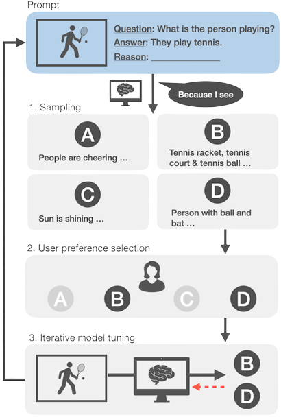

# ILLUME: Rationalizing Vision-Language Models by Interacting with their Jabber

Official implementation of the ILLUME approach for interactive fine-tuning of VLM. Includes data and examples to 
run the ILLUME pipeline for VQA-X as presented in the paper.



## Computing requirements

Evaluating and sampling takes roughly 15 GB on a A100 GPU. 
Fine-tuning the model with deepspeed requires at least 45GB of VRAM with the batch size chosen in the 
paper (256) takes up over 75GB on 8 A100 GPUs each. 

## Prerequisites

The provided code requires downloading the following resources before running it.

### MAGMA checkpoint 
You can download MAGMA weights and config file from the official GitHub repository at https://github.com/Aleph-Alpha/magma.
Note or directly from https://bit.ly/aleph_alpha_magma_download. Please note that this checkpoint may
slightly differ from the one used in the paper. However, the performance is expected to be similar. 

Please consult the ```Docker container``` section on how to properly link your checkpoint and configuration.

### COCO images and VQA-X dataset
Download the 2014 COCO train and val images from https://cocodataset.org/#download. 
In the COCO directory create a directory ````VQA-X```` and place the VQA-X data for all splits provided in this repository 
in ```./utils /vqax_splits```.

Please consult the ```Docker container``` section on how to properly link your image directory.

## Docker Container 
For your convenience we provide a docker container using docker-compose in ```./docker```. The container also installs the zsh shell.
The container builds on the Pytorch Container ```nvcr.io/nvidia/pytorch:21.09-py3```, you can check hardware and driver compatability at: https://docs.nvidia.com/deeplearning/frameworks/pytorch-release-notes/rel_21-09.html#rel_21-09

### Docker Compose
The following setup is required for the ````docker-compose.yml```` file. All places requiring your attention contain a ```<TODO>``` placeholder.

 1. <b>Jupyter Port.</b> The critic and evaluation script utilize a jupyter notebook. Please map the jupyter port ````8888```` to any free port on your local machine.
 2. <b>MAGMA checkpoint & config</b> Please link and name your configuration file and checkpoint so that they will be available at ```/workspace/MAGMA/configs/magma_rn50x16-mp1-config.yml``` and ```/workspace/MAGMA/models/mp_rank_00_model_states-step30000.pt```, respectively.
 3. <b>COCO images</b> Please link COCO images to be available at ```/workspace/datasets/COCO/train2014/train2014/``` and ```/workspace/datasets/COCO/val2014/val2014/``` 

## ILLUME Pipeline 
Subsequently, we provide examples on how to run the ILLUME pipeline for VQA-X. 

### Initial Embeddings
The embeddings for the ground-truth VQA-X training data is computed once before all training iterations
and subsequently only loaded from memory. In order to generate those embeddings run ```python data_preperation/vqax_magma_embed_training_data.py```.
You may perform this in parallel on multiple GPUs using the ```-sp``` argument. E.g call ```python data_preperation/vqax_magma_embed_training_data.py -sp 0 2``` for one GPU and ```python data_preperation/vqax_magma_embed_training_data.py -sp 1 2``` on another. 

### 1) Sample training data 
Generated samples (jabber) from the training data using ```./sampling_evaluation/vqax_magma_eval.py```.
An exemplary call to generate ```5``` explanations each at temperatures ```0.3 & 0.9``` which conditions on the ground truth data from the training set would look like this:
```python sampling_evaluation/vqax_magma_eval.py -d train -ng 5 -tx 0.3 0.8 -gt -s ./results/vqax/it0/train```.
For subsequent iterations that use the model from the previous checkpoint provide the ```-m``` argument pointing to the respective model checkpoint.

If feasible we recommend splitting sampling over multiple GPUs by splitting up temperatures and using the ````-sp```` argument.

### 3) Provide Feedback
To run the simulated critic based on ground truth annotated data, please run and follow the instruction in the jupyter notebook  
````./sampling_evaluation/critic_validation.ipynb````

### 4) Tune on fitting explanations
Tuning on the self-generated and filtered samples from the previous steps, requires to first calculate the embeddings 
of the new training data. To do so execute ```python data_preperation/vqax_magma_embed_illume_iteration.py -i <X>``` where
<X> is your current iteration. 

Next, run the deepspeed training script like ```deepspeed tuning/vqax_magma_ILLUME_tuning.py -i <X>```. Per default this will train on 
the previously generated and filtered data for 5 epochs. For subsequent iterations that build on the checkpoint trained in the previous iteration, provide the ```-m``` argument pointing to the respective model checkpoint.  
Please note that deepspeed will use all GPUs available on the machine if the ````CUDA_VISIBLE_DEVIDES```` environment variable is not set. 
The per GPU batch size is set to 32 and the learning rate is automatically scaled with configurations differing from 8 GPUs to account for the difference in batch size using the square root of the difference in batch size.
After each training epoch a checkpoint of the model is stored at ```/workspace/MAGMA/checkpoints/ILLUME_vqax/it<X>```.

### 5) Evaluate on validation split
For each training epoch of the previous step, generate examples on the validation split ```./sampling_evaluation/vqax_magma_eval.py```
by setting ```-m``` to the respective checkpoint. We recommend generating one explanation at temperature o.1.

Afterwards, run and follow the instruction in  the jupyter notebook  
````./sampling_evaluation/critic_validation.ipynb```` to calculate NLG scores. 


### 6) Repeat
Choose one suitable epoch (based on NLG scores) from the previous iteration and repeat the sampling and training process with the respective checkpoint.
